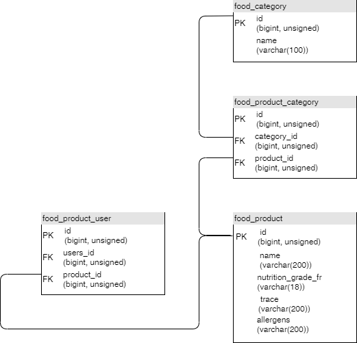

# Projet 8 - Créez une plateforme pour amateurs de Nutella

--------------------------------------------------

## Utilisation 

Aller sur le lien : https://pur-beurre.jeremycombes.fr

Dans la barre de recherche, entre un produit à chercher et valide.
> pain

L'appli propose des aliments se rapprochant du produit contenue dans la base de données.
> pain de mie, pain...

Cliquer sur un sélectionner sous un produit pour que l'appli propose un produit de substitution de la même catégorie et d'un meilleur nutriscore.

Vous pouvez enregistrer le produit de substitution (login nécessaire)

## Utilisation en local

Créer un fichier .env avec la clé django

> SECRET_KEY = ""

Completer le même fichier avec les identifiants de connexion à postgreSQL (le serveur postgreSQL est obligatoire)

> USER = ""
> PASSWORD = ""
> NAME = ""
> PORT = ""

Dans le fichier manager.py, changer :

> ####### disable if production
> ####### env_setting()
en
> ####### disable if production
> ###### env_setting()
pour appeler la fonction env_setting.
Changer aussi :
> os.environ.setdefault('DJANGO_SETTINGS_MODULE', 'pur_beurre.settings.production')
en 
> os.environ.setdefault('DJANGO_SETTINGS_MODULE', 'pur_beurre.settings.development')

Utiliser python 3.9 et pip install -r requirements.txt

## Api utilisée:

Cette application utilise l'api Openfoodfacts

## Commande

Il y a plusieurs commande pour mettre à jour la base de données.
- Sous window par exemple
> py -m manage database --help

Mettre à jour la base de données des catégories :

> py -m manage database --category update

ou 

> py -m manage database --category up

Supprimer la base de données des catégories :

> py -m manage database --category del

Mettre à jour la base de données des produits :

> py -m manage database --product update

ou 

> py -m manage database --product up

Supprimer la base de données des produits :

> py -m manage database --product del

## Tableau de la base de données

